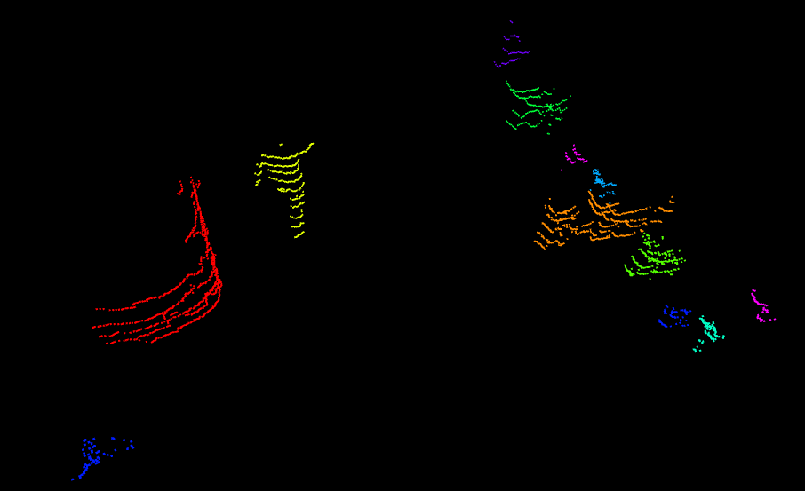

## Fast DBSCAN with range image clustering for 3D LiDAR Point Clouds
An ROS implementation for dbscan clustering of 3D LiDAR point clouds

## Reference
* https://github.com/JaminJiang/dbscan_kdtree
* Autoware: core perception

## Features
* very fast comparing to traditional dbscan algorithm

**TODOs**
* imporove the segmentation accuracy 

**Known Issues**
* 

## Dependencies
* ground plane filter topic "/patchwork/non_ground_cloud_front"
* autoware-msgs
* pcl

## How to use
    # clone the repo
    mkdir -p catkin_ws/src
    cd catkin_ws/src
    git clone ...
    cd ../
    catkin_make 
    roslaunch range_dbscan_segment range_image_dbscan_segment.launch

## Contribution
You are welcome contributing to the package by opening a pull-request

We are following: 
[Google C++ Style Guide](https://google.github.io/styleguide/cppguide.html), 
[C++ Core Guidelines](https://isocpp.github.io/CppCoreGuidelines/CppCoreGuidelines#main), 
and [ROS C++ Style Guide](http://wiki.ros.org/CppStyleGuide)

## License
MIT License